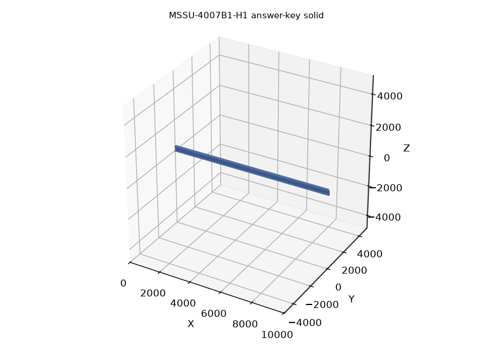
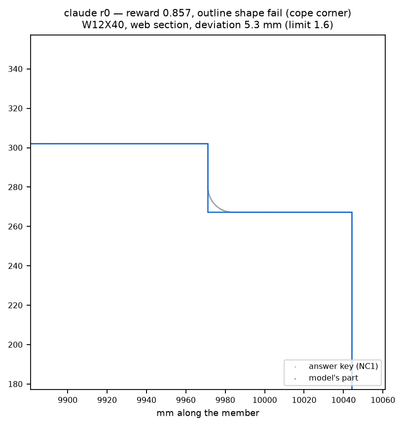
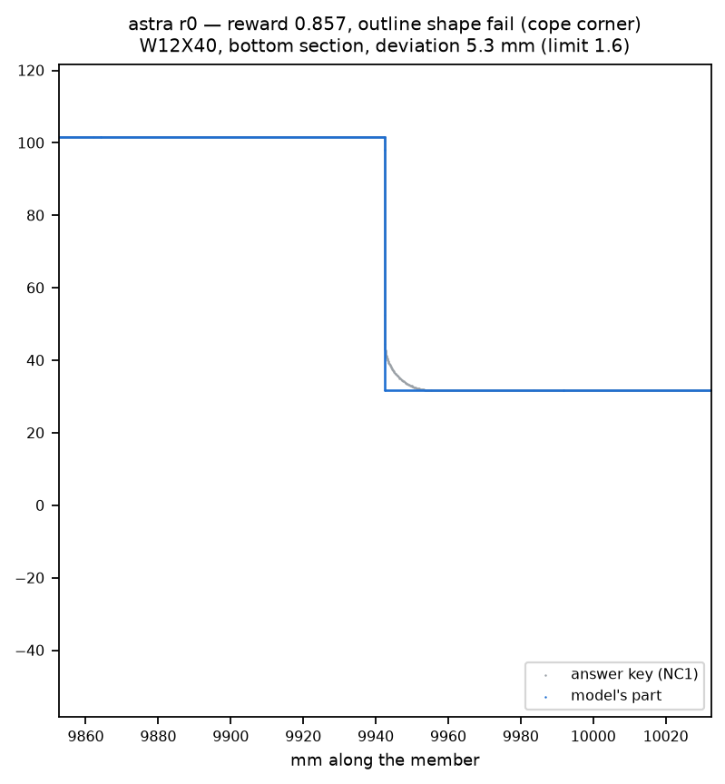
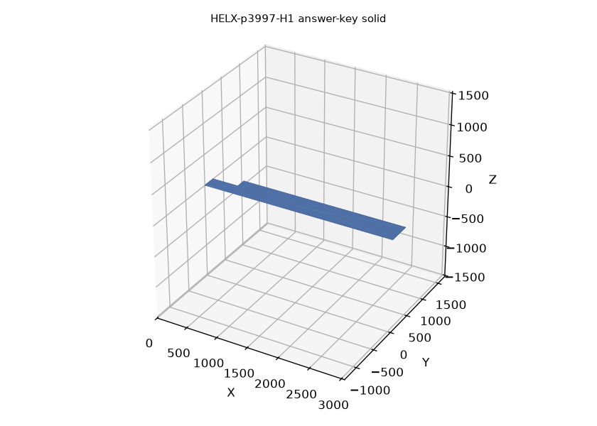
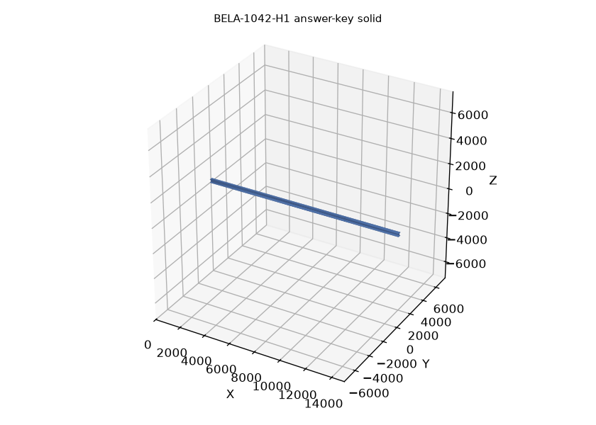
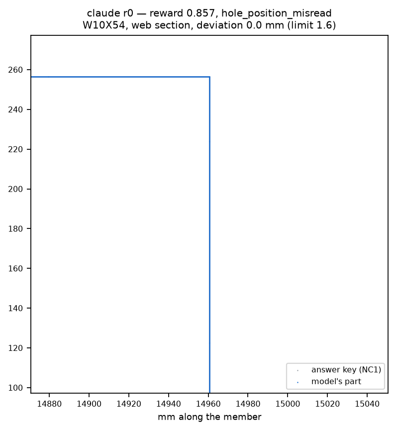
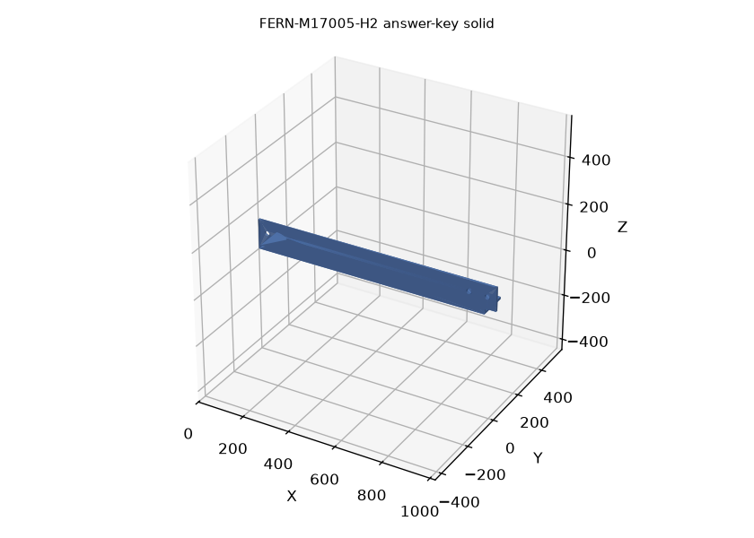

# SteelEnv examples

A SteelEnv task gives an agent a real fabrication shop drawing (or, at the easier tiers, its requirement table) for one steel piece: a plate, an angle or a wide-flange beam. The agent writes CadQuery code that builds the part in millimetres, with a small budget of tool calls. The saved solid is graded against the fabricator's NC1 CNC file for that piece, which is what the shop actually cut. A part only earns full credit if it could be fabricated as drawn.

The verifier aligns the submitted solid to the answer key (any rigid placement, never a mirror image) and runs seven checks after gates for a single valid solid with through holes:

- **thickness**: plate, leg, flange and web thickness (±0.5 mm)
- **outline_bbox**: overall length and width
- **outline_shape**: two-way distance between the section outlines (copes, notches, clips, corner radii)
- **hole_count**: same number of holes
- **hole_diameters**: diameters match (±0.2 mm), including at each matched position
- **hole_positions**: every hole within tolerance of its matched answer-key hole
- **volume**: within 3%

Requirement-table tiers (L0/L1) use 0.5 mm for positions and outlines (1 mm for outline shape). The drawing tiers (L3, L4, L5) allow 1.6 mm: 1/16" drawing precision plus a margin. Reward is the fraction of checks passed. A task counts as solved only at 7/7.

**457**scored test tasks (frozen 493 minus 36 errata)

**88.4%**GPT-6 Astra, 8 calls (95% CI 85.6–91.1); 90.5% at 32

**68.4%**Claude Opus 5.5, 8 calls; 68.4% at 32

**21.8%**Qwen3.8-27B, 8 calls; 30.0% at 32

**New:** [H3 + H4 hard-tier leaderboard](https://deccanai-org.github.io/steelenv-examples/leaderboard/) — the two hardest tiers (119 + 96 tasks, b=32, 2 repeats). All three frontier models scored 0% full credit on both tiers; the page reports the honest zeros alongside builds-ok, cost and runtime.

Headline leaderboard for benchmark v1.3 (results/leaderboard.md): mean full-credit rate over two runs. The tables below recompute these figures from the result files and match them.

## Pass rates over two runs

Each model ran every task twice at each budget. **pass@1** is the mean full-credit rate of the two runs; **pass@2** counts a task as solved if either run earned full credit (all 7 checks). Cells read pass@1 / pass@2, in percent. Test set (v1.3): the frozen list minus 36 errata (457 tasks), with the 22 bug-15 re-runs in place. Bel Air: the 110-task extension set.

### Overall

| model | calls | test (n=457) | Bel Air (n=110) |
| --- | --- | --- | --- |
| GPT-6 Astra | 8 | 88.4/90.4 | 98.2/98.2 |
| GPT-6 Astra | 32 | 90.5/91.7 | 97.7/98.2 |
| Claude Opus 5.5 | 8 | 68.4/72.4 | 97.7/99.1 |
| Claude Opus 5.5 | 32 | 68.4/73.7 | 96.8/97.3 |
| Qwen3.8-27B | 8 | 21.8/29.1 | 47.3/60.0 |
| Qwen3.8-27B | 32 | 30.0/37.6 | 55.0/65.5 |

### By tier

| model | calls | L0+L1 (n=49) | L3 (n=250) | L4 (n=114) | L5 (n=44) |
| --- | --- | --- | --- | --- | --- |
| GPT-6 Astra | 8 | 100.0/100.0 | 88.6/90.0 | 89.5/91.2 | 71.6/79.5 |
| GPT-6 Astra | 32 | 100.0/100.0 | 89.6/90.8 | 91.2/92.1 | 83.0/86.4 |
| Claude Opus 5.5 | 8 | 100.0/100.0 | 65.8/71.2 | 69.7/73.7 | 44.3/45.5 |
| Claude Opus 5.5 | 32 | 99.0/100.0 | 65.2/70.4 | 71.1/78.1 | 45.5/52.3 |
| Qwen3.8-27B | 8 | 86.7/95.9 | 18.0/26.8 | 4.8/7.9 | 14.8/22.7 |
| Qwen3.8-27B | 32 | 94.9/100.0 | 26.2/35.6 | 12.7/16.7 | 23.9/34.1 |

### By part type

| model | calls | plate (n=138) | angle (n=59) | beam (n=216) | L5 assembly (n=44) |
| --- | --- | --- | --- | --- | --- |
| GPT-6 Astra | 8 | 93.5/93.5 | 93.2/93.2 | 87.3/89.8 | 71.6/79.5 |
| GPT-6 Astra | 32 | 93.5/94.9 | 93.2/93.2 | 89.4/90.3 | 83.0/86.4 |
| Claude Opus 5.5 | 8 | 86.6/90.6 | 78.8/83.1 | 58.8/63.4 | 44.3/45.5 |
| Claude Opus 5.5 | 32 | 86.6/89.1 | 74.6/76.3 | 59.7/67.6 | 45.5/52.3 |
| Qwen3.8-27B | 8 | 43.5/56.5 | 32.2/45.8 | 6.5/8.3 | 14.8/22.7 |
| Qwen3.8-27B | 32 | 58.0/69.6 | 41.5/49.2 | 10.2/14.8 | 23.9/34.1 |

Tiers: L0/L1 give the requirement table as text; L3 gives the single-part shop drawing; L4 gives a sheet with several pieces and asks for one; L5 asks for every piece on an assembly sheet. Part type comes from the frozen list; L5 tasks are listed as assemblies. Re-running the bug-13 Qwen episodes changed Qwen's rates by at most 0.3 points.

## Failure modes

Every genuine failure (reward below 1, not explained by drawing rounding) of the 32-call, repeat-0 runs gets one primary atomic mode from the failure ontology (benchmark/ONTOLOGY.md, v0.4): 6 causes, 36 atomic modes. Labels were assigned by an LLM labeller; free-text "new mode" labels are re-mapped to v0.4 as in scripts/taxonomy_saturation.py. Shares and top modes below use the v1.3 label set (results/v13_derived.json): of 605 labels, 48 on errata tasks and 42 stale labels on the bug-15 re-run tasks are dropped, leaving 515 (Claude 141, Astra 36, Qwen 338). The 29 new failures among the re-run episodes (Claude 8, Astra 1, Qwen 20) are not labelled yet.

| cause | the agent… |
| --- | --- |
| **P** perception | misread or did not see something printed on the drawing |
| **R** dimensional reasoning | read the right numbers but combined them wrongly |
| **C** domain convention | missed a steel-detailing convention that the drawing assumes |
| **X** cross-view / 3D reasoning | failed to combine views, or to infer geometry implied by another view |
| **F** reference resolution | modelled the wrong object (wrong piece, fittings included, piece missing) |
| **E** execution | knew what to build but the CAD construction or the submission was wrong |

### Share of each model's failures by cause

GPT-6 Astra (n=36)Claude Opus 5.5 (n=141)Qwen3.8-27B (n=338)

| model | failures | P | R | C | X | F | E |
| --- | --- | --- | --- | --- | --- | --- | --- |
| GPT-6 Astra | 36 | 50% (18) | 17% (6) | 25% (9) | 6% (2) | 3% (1) | 0% (0) |
| Claude Opus 5.5 | 141 | 23% (32) | 14% (20) | 52% (74) | 1% (2) | 0% (0) | 9% (13) |
| Qwen3.8-27B | 338 | 41% (139) | 23% (79) | 7% (24) | 4% (14) | 2% (6) | 22% (76) |

### Top 5 modes per model

#### GPT-6 Astra

1. **P4** feature_not_seen 6 (17%)\
   a cope, notch, clip, dap or cut shown on the drawing not modelled
2. **P5** dense_group_holes_dropped 4 (11%)\
   holes of a dense group missing
3. **P1** dimension_misread 4 (11%)\
   a printed length / width value misread (digit, fraction, ft-in)
4. **C3** cope_corner_square 3 (8%)\
   re-entrant cut corner left square where the fabricator's radius applies (drawn rounded, radius not dimensioned)
5. **C1** section_guessed 3 (8%)\
   section dimensions (d, bf, tf, tw, angle legs) guessed instead of taken from the catalogue

#### Claude Opus 5.5

1. **C3** cope_corner_square 71 (50%)\
   re-entrant cut corner left square where the fabricator's radius applies (drawn rounded, radius not dimensioned)
2. **R5** extra_holes 11 (8%)\
   more holes than the part has (pattern duplicated, both legs / flanges)
3. **E3** no_holes_submitted 9 (6%)\
   outline submitted without its holes (often out of calls)
4. **P1** dimension_misread 9 (6%)\
   a printed length / width value misread (digit, fraction, ft-in)
5. **P4** feature_not_seen 8 (6%)\
   a cope, notch, clip, dap or cut shown on the drawing not modelled

#### Qwen3.8-27B

1. **P4** feature_not_seen 61 (18%)\
   a cope, notch, clip, dap or cut shown on the drawing not modelled
2. **R5** extra_holes 40 (12%)\
   more holes than the part has (pattern duplicated, both legs / flanges)
3. **E1** blind_hole 32 (9%)\
   a hole that does not go through
4. **P3** hole_diameter_misread 25 (7%)\
   a called-out hole diameter misread
5. **R2** wrong_reference 23 (7%)\
   dimension measured from the wrong edge, end, heel or work point

### Bel Air extension (separate labelling)

Labels from results/failure_labels_bela.jsonl, same ontology; Astra and Claude fail very few Bel Air tasks, so only Qwen's distribution says much.

| model | failures | by cause | modes (count) |
| --- | --- | --- | --- |
| GPT-6 Astra | 3 | P 3 | P3 hole_diameter_misread (1), P6 hole_symbol_misread (1), P1 dimension_misread (1) |
| Claude Opus 5.5 | 3 | R 2, E 1 | E3 no_holes_submitted (1), R6 cut_geometry_wrong (1), R2 wrong_reference (1) |
| Qwen3.8-27B | 51 | P 25, R 20, C 3, X 2, E 1 | P8 phantom_feature (11), R2 wrong_reference (8), P1 dimension_misread (6), R5 extra_holes (5), R4 unit_conversion (3), P2 thickness_misread (3), R6 cut_geometry_wrong (2), P4 feature_not_seen (2), P3 hole_diameter_misread (2), C5 hand_mirrored (2), R1 chained_dimension_error (1), X4 cut_on_wrong_flange (1), E4 build_error (1), P5 dense_group_holes_dropped (1), X3 wrong_face (1), C3 cope_corner_square (1), R3 skew_cut_misread (1) |

**Saturation.** Over 10 random orderings of the 605 labelled failures, a median 98.3% of the failures in the second half fall in modes already seen in the first half (results/taxonomy_saturation.json, v0.4; computed on the pre-v1.3 label set).

**Hard-tier (H1 / H2) examples added.** Examples 1–14 are all drawn from the main-set tiers (L1 / L3 / L4 / L5) where the frontier models are near ceiling; the model-gap-widening story that §7 Headroom reports lives on H1 / H2, which the main set doesn't illustrate. Examples 15–18 close that gap: one per failure pattern the paper calls out — Astra "wrong hand" angle (C5, hand/mirror convention peeled off in H2), Claude's #1 cope-corner mode on a hard beam (C3), Astra bent-plate "formed vs developed" (the C7 new mode, H1 only), and a Qwen total-failure beam that the frontier models solve. Model-outcome rows use repeat-0 data from `results/failure_labels_h1h2.jsonl` / `failures_h1h2.csv`; repeat-1 numbers are omitted because the on-disk failures table is r0 only; answer-key renders are generated from each task's `oracle_code` into `SteelEnv-examples-figures/<task_id>_answer_key.png`; failed-part overlays for examples 16 and 18 are rendered from the saved `.brep` files in `traces/{claude,openai}/<task_id>__*.brep` via `scripts/make_figure2.py::panel_beam`.

## The 19 examples
| # | task | tier | part | split | GPT-6 Astra solved, by calls | Claude Opus 5.5 solved, by calls | Qwen3.8-27B solved, by calls |
| --- | --- | --- | --- | --- | --- | --- | --- |
| 1 | [HELX-p2642-L1](#1-helx-p2642-l1) | L1 | plate | test | 8: 2/2 · 32: 2/2 | 8: 2/2 · 32: 2/2 | 8: 2/2 · 32: 2/2 |
| 2 | [MT18048-BR1200-L1](#2-mt18048-br1200-l1) | L1 | angle | train | no runs | no runs | no runs |
| 3 | [HELX-p2272-L3](#3-helx-p2272-l3) | L3 | plate | test | 8: 2/2 · 32: 2/2 | 8: 1/2 · 32: 1/2 | 8: 2/2 · 32: 2/2 |
| 4 | [FERN-M16013-L3](#4-fern-m16013-l3) | L3 | angle | test | 8: 2/2 · 32: 2/2 | 8: 2/2 · 32: 0/2 | 8: 0/2 · 32: 0/2 |
| 5 | [MSSU-2011B1-L3](#5-mssu-2011b1-l3) | L3 | beam | test | 8: 2/2 · 32: 2/2 | 8: 1/2 · 32: 0/2 | 8: 0/2 · 32: 0/2 |
| 6 | [MSSU-4006B3-L3](#6-mssu-4006b3-l3) | L3 | beam | test | 8: 1/2 · 32: 1/2 | 8: 0/2 · 32: 0/2 | 8: 0/2 · 32: 0/2 |
| 7 | [BELA-p297_2-L3](#7-bela-p297_2-l3) | L3 | plate | ext | 8: 2/2 · 32: 2/2 | 8: 1/2 · 32: 0/2 | 8: 0/2 · 32: 0/2 |
| 8 | [MT20023-2080-L3](#8-mt20023-2080-l3) | L3 | beam | train | no runs | no runs | no runs |
| 9 | [FERN-B10059-L3](#9-fern-b10059-l3) | L3 | beam | test | 8: 0/2 · 32: 0/2 | 8: 0/2 · 32: 0/2 | 8: 0/2 · 32: 0/2 |
| 10 | [MSSU-p348-L3](#10-mssu-p348-l3) | L3 | plate | test | 8: 0/2 · 32: 0/2 | 8: 2/2 · 32: 1/2 | 8: 0/2 · 32: 0/2 |
| 11 | [HELX-M17014-L3](#11-helx-m17014-l3) | L3 | angle | test (errata) | 8: 0/2 · 32: 0/2 | 8: 0/2 · 32: 0/2 | 8: 0/2 · 32: 0/2 |
| 12 | [HELX-B13030-L3](#12-helx-b13030-l3) | L3 | beam | test (bug-15 re-run) | 8: 2/2 · 32: 2/2 | 8: 2/2 · 32: 1/2 | 8: 0/2 · 32: 0/2 |
| 13 | [FERN-B1057-L4](#13-fern-b1057-l4) | L4 | beam | test | 8: 1/2 · 32: 2/2 | 8: 2/2 · 32: 1/2 | 8: 0/2 · 32: 0/2 |
| 14 | [MSSU-2019B1-L5](#14-mssu-2019b1-l5) | L5 | assembly | test | 8: 2/2 · 32: 2/2 | 8: 0/2 · 32: 0/2 | 8: 0/2 · 32: 0/2 |
| 15 | [MSSU-S2010-L6](#15-mssu-s2010-l6) | L6 | sheet | test | not yet evaluated | not yet evaluated | not yet evaluated |
| 16 | [MSSU-4007B1-H1](#16-mssu-4007b1-h1) | H1 | beam | test | 32 r0: 0.857 cope_corner | 32 r0: 0.857 cope_corner | 32 r0: 0.0 gate_fail |
| 17 | [HELX-p3997-H1](#17-helx-p3997-h1) | H1 | plate | test | 32 r0: 0.571 formed_not_flat | 32 r0: 0.571 formed_not_flat | 32 r0: 0.429 |
| 18 | [BELA-1042-H1](#18-bela-1042-h1) | H1 | beam | test | 32 r0: solved (not in fails) | 32 r0: 0.857 hole_misread | 32 r0: 0.0 gate_fail |
| 19 | [FERN-M17005-H2](#19-fern-m17005-h2) | H2 | angle | test | 32 r0: 0.857 wrong_hand | 32 r0: 0.857 wrong_hand | 32 r0: 0.714 |

“8: 1/2” means one of the two 8-call runs earned full credit.

## Examples

**Where GPT-6 Astra fails.** On the v1.3 scored set (457 tasks) Astra misses about one task in nine: pass@1 is 88.4% at 8 calls and 90.5% at 32. It fails both runs on 44 tasks at 8 calls and 38 at 32 calls. On only one of those at each budget does Claude solve both runs (MSSU-p348-L3 at 8 calls, HELX-M6020-L3 at 32). Its 36 labelled failures (v1.3 label set) are half perception (50%) and a quarter domain convention (25%). The top modes are P4 feature_not_seen (6), P5 dense_group_holes_dropped (4), P1 dimension_misread (4), C3 cope_corner_square (3) and C1 section_guessed (3). Most of the old C1 labels went away with the bug-15 catalogue fix. Example 11 shows P4 and example 12 shows P5. Example 13 looked like a shared P1 failure until it turned out to be a drawing/NC1 disagreement, and example 14 was a C1 failure caused by the tool's missing catalogue entry.

### 1 HELX-p2642-L1
L1plateproject HELXsplit: testtolerance 0.5 mm (table tier)

**What makes it hard:** Little is hard here: every number is in the requirement table. The outline has a clipped corner and the holes are off-grid, and the table tier allows only 0.5 mm.

Task prompt

```
Model steel plate piece mark **p2642** from this requirement table.

Units: millimetres. Build ONE solid steel plate and assign it to a variable named `result`.
Recommended frame: plate flat in XY, thickness along +Z from z=0, outline bounding box starting at (0,0). Any rigid placement/orientation is accepted (the grader aligns by bounding box and the plate's in-plane symmetries). All holes are drilled completely through the plate.
You have at most 8 tool calls; the last successfully built model is what gets graded when you submit.

| requirement | value |
|---|---|
| designation | PL1/4X6 |
| grade | A36 |
| thickness | 6.35 mm |
| overall size (X x Y) | 203.2 x 152.4 mm |
| outline | see outline table |
| holes | 2 through |

Outline (closed, X/Y in mm from the bounding-box corner):

| # | type | from | to | note |
|---|---|---|---|---|
| 1 | line | (0, 0) | (203.2, 0) | |
| 2 | line | (203.2, 0) | (203.2, 152.4) | |
| 3 | line | (203.2, 152.4) | (34.92, 152.4) | |
| 4 | line | (34.92, 152.4) | (0, 117.47) | |
| 5 | line | (0, 117.47) | (0, 0) | |

Holes (centre X/Y in mm from the bounding-box corner):

| # | X | Y | diameter | type |
|---|---|---|---|---|
| 1 | 69.53 | 87.27 | 20.64 | through |
| 2 | 145.15 | 77.9 | 20.64 | through |
```

#### Answer key (from the NC1 file)

| profile | PL1/4X6 |
| --- | --- |
| size | 203.2 × 152.4 mm |
| thickness | 6.35 mm |
| outline | 5 segments, 0 arcs (1 more than a rectangle) |
| holes | 2: 2 × Ø20.64 |

HELX-p2642-L1 answer key render

Answer-key solid built from the NC1 spec (isometric; on long members the length axis is compressed and both ends are shown).

HELX-p2642-L1 answer key sections

The section outlines the verifier compares, with holes as circles.

#### Model outcomes

| model | calls | solved | reward r0 / r1 | thk | bbox | shape | #holes | hole dia | hole pos | vol | failure label (32 calls, r0) |
| --- | --- | --- | --- | --- | --- | --- | --- | --- | --- | --- | --- |
| GPT-6 Astra | 8 | 2/2 | 1 / 1 | ✓ | ✓ | ✓ | ✓ | ✓ | ✓ | ✓ |  |
| GPT-6 Astra | 32 | 2/2 | 1 / 1 | ✓ | ✓ | ✓ | ✓ | ✓ | ✓ | ✓ | – |
| Claude Opus 5.5 | 8 | 2/2 | 1 / 1 | ✓ | ✓ | ✓ | ✓ | ✓ | ✓ | ✓ |  |
| Claude Opus 5.5 | 32 | 2/2 | 1 / 1 | ✓ | ✓ | ✓ | ✓ | ✓ | ✓ | ✓ | – |
| Qwen3.8-27B | 8 | 2/2 | 1 / 1 | ✓ | ✓ | ✓ | ✓ | ✓ | ✓ | ✓ |  |
| Qwen3.8-27B | 32 | 2/2 | 1 / 1 | ✓ | ✓ | ✓ | ✓ | ✓ | ✓ | ✓ | – |

Checks shown for repeat 0 (r0). ✓ pass, ✗ fail. Failure labels exist only for the 32-call repeat-0 run.

**What it shows.** This is the baseline. With the dimensions given as text, all three models solve it in all 12 runs, as they do every plate on the L1 test list. The difficulty at higher tiers comes from reading the drawing, not from CadQuery.

### 2 MT18048-BR1200-L1
L1angleproject MT18048split: traintolerance 0.5 mm (table tier)

**What makes it hard:** An equal-leg angle (L4X4X1/4) with two hole groups at mirror-symmetric positions, four holes of 20.64 mm at one end and four of 23.81 mm at the other. Because the legs are equal, a rotated part lands every hole on a valid position.

Task prompt

```
Model steel angle piece mark **BR1200** from this requirement table.

Units: millimetres. Build ONE solid steel angle and assign it to a variable named `result`.
Recommended frame: length along +X from x=0 at the start end; the heel (outside corner of the angle) runs along the X axis; leg A lies in the XY plane and extends along +Y (0 <= z <= t); leg B lies in the XZ plane and extends along +Z (0 <= y <= t). The root fillet in the inside corner is optional. Any rigid placement with the legs parallel to the axes is accepted, but a MIRROR IMAGE is not: an angle and its mirror are different parts, so build the same hand as specified. Hole positions are given as x (from the start end) and gauge g (from the heel) on a leg. All holes are drilled completely through the leg.
You have at most 8 tool calls; the last successfully built model is what gets graded when you submit.

| requirement | value |
|---|---|
| designation | L4X4X1/4 |
| grade | A36 |
| length | 3146.7 mm |
| leg A (along +Y) | 101.6 mm |
| leg B (along +Z) | 101.6 mm |
| leg thickness | 6.35 mm |
| root fillet radius (optional) | 9.52 mm |
| ends | square cut, both legs full length |
| holes | 8 through |

Holes:

| # | leg | x from start | gauge g from heel | diameter |
|---|---|---|---|---|
| 1 | B | 50.8 | 50.8 | 20.64 |
| 2 | B | 127 | 50.8 | 20.64 |
| 3 | B | 203.2 | 50.8 | 20.64 |
| 4 | B | 279.4 | 50.8 | 20.64 |
| 5 | B | 2867.3 | 50.8 | 23.81 |
| 6 | B | 2943.5 | 50.8 | 23.81 |
| 7 | B | 3019.7 | 50.8 | 23.81 |
| 8 | B | 3095.9 | 50.8 | 23.81 |
```

#### Answer key (from the NC1 file)

| profile | L4X4X1/4 |
| --- | --- |
| length | 3146.7 mm |
| legs A × B | 101.6 × 101.6 mm |
| thickness | 6.35 mm |
| leg A outline | 4 segments, 0 arcs (full length, square ends) |
| leg B outline | 4 segments, 0 arcs (full length, square ends) |
| holes | 8: 4 × Ø20.64 (leg B); 4 × Ø23.81 (leg B) |

MT18048-BR1200-L1 answer key render

Answer-key solid built from the NC1 spec (isometric; on long members the length axis is compressed and both ends are shown).

MT18048-BR1200-L1 answer key sections

The section outlines the verifier compares, with holes as circles.

synthetic swapped-diameter part

Synthetic check (built here, not a model output): the same 8 hole positions with the two diameters swapped end for end. The pre-v1.3 check compared sorted diameter lists and would have accepted it (sorted lists match: yes); the current verifier scores 6/7 and fails hole_diameters because it also compares the diameter of each position-matched pair.

#### Model outcomes

No model results: this is a training-pool task, so it was never in a leaderboard run.

**What it shows.** This is the case that exposed the hole-diameter bug. A part with the two sizes swapped end for end has the same sorted list of diameters, so the old check accepted it. The verifier now also compares the diameter at each position-matched pair, and rejects it. This is a training-pool task, so there are no model results.

### 3 HELX-p2272-L3
L3plateproject HELXsplit: testtolerance 1.6 mm (drawing tier)

**What makes it hard:** The same kind of plate as example 1 (PL1/4X6, clipped corner, two holes), but now read from the shop drawing in feet-inches.

Task prompt

```
Model steel plate piece mark **p2272** using only the attached shop drawing (read it with read_pdf_page). The attached drawing is the single-part shop drawing for this plate. Drawing dimensions are in feet-inches; convert to millimetres (1 in = 25.4 mm).

Units: millimetres. Build ONE solid steel plate and assign it to a variable named `result`.
Recommended frame: plate flat in XY, thickness along +Z from z=0, outline bounding box starting at (0,0). Any rigid placement/orientation is accepted (the grader aligns by bounding box and the plate's in-plane symmetries). All holes are drilled completely through the plate.
You have at most 8 tool calls; the last successfully built model is what gets graded when you submit.
```

#### Answer key (from the NC1 file)

| profile | PL1/4X6 |
| --- | --- |
| size | 203.2 × 152.4 mm |
| thickness | 6.35 mm |
| outline | 5 segments, 0 arcs (1 more than a rectangle) |
| holes | 2: 2 × Ø20.64 |

HELX-p2272-L3 answer key render

Answer-key solid built from the NC1 spec (isometric; on long members the length axis is compressed and both ends are shown).

HELX-p2272-L3 answer key sections

The section outlines the verifier compares, with holes as circles.

#### Model outcomes

| model | calls | solved | reward r0 / r1 | thk | bbox | shape | #holes | hole dia | hole pos | vol | failure label (32 calls, r0) |
| --- | --- | --- | --- | --- | --- | --- | --- | --- | --- | --- | --- |
| GPT-6 Astra | 8 | 2/2 | 1 / 1 | ✓ | ✓ | ✓ | ✓ | ✓ | ✓ | ✓ |  |
| GPT-6 Astra | 32 | 2/2 | 1 / 1 | ✓ | ✓ | ✓ | ✓ | ✓ | ✓ | ✓ | – |
| Claude Opus 5.5 | 8 | 1/2 | 1 / 0.857 | ✓ | ✓ | ✓ | ✓ | ✓ | ✓ | ✓ |  |
| Claude Opus 5.5 | 32 | 1/2 | 0.857 / 1 | ✓ | ✓ | ✓ | ✓ | ✗ | ✓ | ✓ | P3 hole_diameter_misread |
| Qwen3.8-27B | 8 | 2/2 | 1 / 1 | ✓ | ✓ | ✓ | ✓ | ✓ | ✓ | ✓ |  |
| Qwen3.8-27B | 32 | 2/2 | 1 / 1 | ✓ | ✓ | ✓ | ✓ | ✓ | ✓ | ✓ | – |

Checks shown for repeat 0 (r0). ✓ pass, ✗ fail. Failure labels exist only for the 32-call repeat-0 run.

#### Failed parts against the answer key (repeat 0)

Grey: answer key. Blue: the model's saved part, placed in the verifier's aligned frame. The red box on the full-length view marks the zoom.

Claude Opus 5.5, 32 calls

Claude Opus 5.5, 32 calls, reward 0.857

**What it shows.** Claude's failing run has the outline and both hole positions exactly right, but one hole is 23.81 mm (15/16") where the NC1 has 20.64 mm. Only the hole_diameters check fails, and a volume or IoU metric would barely notice. Qwen3.8-27B solves this one in all four runs.

### 4 FERN-M16013-L3
L3angleproject FERNsplit: testtolerance 1.6 mm (drawing tier)

**What makes it hard:** An L5X5X3/8 angle with a notch cut out of leg B that has a radiused re-entrant corner. Leg A runs full length, so the model has to put the cut on the right leg.

Task prompt

```
Model steel angle piece mark **M16013** using only the attached shop drawing (read it with read_pdf_page). The attached drawing is the single-part shop drawing for this angle. Drawing dimensions are in feet-inches; convert to millimetres (1 in = 25.4 mm). Build the part as the drawing shows it, not its mirror image.

Units: millimetres. Build ONE solid steel angle and assign it to a variable named `result`.
Recommended frame: length along +X from x=0 at the start end; the heel (outside corner of the angle) runs along the X axis; leg A lies in the XY plane and extends along +Y (0 <= z <= t); leg B lies in the XZ plane and extends along +Z (0 <= y <= t). The root fillet in the inside corner is optional. Any rigid placement with the legs parallel to the axes is accepted, but a MIRROR IMAGE is not: an angle and its mirror are different parts, so build the same hand as specified. Hole positions are given as x (from the start end) and gauge g (from the heel) on a leg. All holes are drilled completely through the leg.
You have at most 8 tool calls; the last successfully built model is what gets graded when you submit.
```

#### Answer key (from the NC1 file)

| profile | L5X5X3/8 |
| --- | --- |
| length | 2305.37 mm |
| legs A × B | 127 × 127 mm |
| thickness | 9.52 mm |
| leg A outline | 4 segments, 0 arcs (full length, square ends) |
| leg B outline | 7 segments, 1 arcs (cut / notched) |
| holes | 4: 4 × Ø20.64 (leg B) |

FERN-M16013-L3 answer key render

Answer-key solid built from the NC1 spec (isometric; on long members the length axis is compressed and both ends are shown).

FERN-M16013-L3 answer key sections

The section outlines the verifier compares, with holes as circles.

#### Model outcomes

| model | calls | solved | reward r0 / r1 | thk | bbox | shape | #holes | hole dia | hole pos | vol | failure label (32 calls, r0) |
| --- | --- | --- | --- | --- | --- | --- | --- | --- | --- | --- | --- |
| GPT-6 Astra | 8 | 2/2 | 1 / 1 | ✓ | ✓ | ✓ | ✓ | ✓ | ✓ | ✓ |  |
| GPT-6 Astra | 32 | 2/2 | 1 / 1 | ✓ | ✓ | ✓ | ✓ | ✓ | ✓ | ✓ | – |
| Claude Opus 5.5 | 8 | 2/2 | 1 / 1 | ✓ | ✓ | ✓ | ✓ | ✓ | ✓ | ✓ |  |
| Claude Opus 5.5 | 32 | 0/2 | 0.857 / 0.857 | ✓ | ✓ | ✗ | ✓ | ✓ | ✓ | ✓ | C3 cope_corner_square |
| Qwen3.8-27B | 8 | 0/2 | 0 / 0 | r0: gate failed (builds), no checks scored |  |  |  |  |  |  |  |
| Qwen3.8-27B | 32 | 0/2 | 0.857 / 0.714 | ✓ | ✓ | ✗ | ✓ | ✓ | ✓ | ✓ | X4 cut_on_wrong_flange |

Checks shown for repeat 0 (r0). ✓ pass, ✗ fail. Failure labels exist only for the 32-call repeat-0 run.

#### Failed parts against the answer key (repeat 0)

Grey: answer key. Blue: the model's saved part, placed in the verifier's aligned frame. The red box on the full-length view marks the zoom.

Claude Opus 5.5, 32 calls

Claude Opus 5.5, 32 calls, reward 0.857

Qwen3.8-27B, 8 calls: no part was built (no B-rep saved)

Qwen3.8-27B, 32 calls

Qwen3.8-27B, 32 calls, reward 0.857

**What it shows.** Astra solves it in all four runs. Claude solves it at 8 calls but fails both 32-call runs: it leaves the notch corner square, which puts the outline 5.5 mm off where the fabricator burns a radius (C3). Qwen cuts the wrong leg (X4) and is off by 104 mm.

### 5 MSSU-2011B1-L3
L3beamproject MSSUsplit: testtolerance 1.6 mm (drawing tier)

**What makes it hard:** A W21X44 beam with copes at both ends, top and bottom. Each cope corner has a radius that the drawing shows rounded but does not dimension.

Task prompt

```
Model steel beam piece mark **2011B1** (W21X44) using only the attached shop drawing (read it with read_pdf_page); it is the main member detailed on this sheet. Drawing dimensions are in feet-inches (1 in = 25.4 mm). Use lookup_shape for section dimensions.

Units: millimetres. Build ONE solid W-shape beam and assign it to a variable named `result`.
Recommended frame: length along +X from x=0 at the start end; bottom of the bottom flange at z=0 (depth along +Z); web centred on y=0 (flanges across Y). Root fillets are optional. Any rigid placement is accepted, but not a mirror image. Web holes are given as (x, z = height above the bottom of the beam); flange holes as (x, y = offset from the web centreline). All holes are drilled through.
You have at most 8 tool calls; the last successfully built model is what gets graded when you submit.
```

#### Answer key (from the NC1 file)

| profile | W21X44 |
| --- | --- |
| length | 11168.1 mm |
| depth × flange | 525.78 × 165.1 mm |
| tf / tw | 11.43 / 8.89 mm |
| web outline | 16 segments, 4 arcs (copes / cuts) |
| top outline | 4 segments, 0 arcs |
| bottom outline | 4 segments, 0 arcs |
| holes | 10: 10 × Ø20.64 (web) |

MSSU-2011B1-L3 answer key render

Answer-key solid built from the NC1 spec (isometric; on long members the length axis is compressed and both ends are shown).

MSSU-2011B1-L3 answer key sections

The section outlines the verifier compares, with holes as circles.

#### Model outcomes

| model | calls | solved | reward r0 / r1 | thk | bbox | shape | #holes | hole dia | hole pos | vol | failure label (32 calls, r0) |
| --- | --- | --- | --- | --- | --- | --- | --- | --- | --- | --- | --- |
| GPT-6 Astra | 8 | 2/2 | 1 / 1 | ✓ | ✓ | ✓ | ✓ | ✓ | ✓ | ✓ |  |
| GPT-6 Astra | 32 | 2/2 | 1 / 1 | ✓ | ✓ | ✓ | ✓ | ✓ | ✓ | ✓ | – |
| Claude Opus 5.5 | 8 | 1/2 | 1 / 0.857 | ✓ | ✓ | ✓ | ✓ | ✓ | ✓ | ✓ |  |
| Claude Opus 5.5 | 32 | 0/2 | 0.857 / 0.857 | ✓ | ✓ | ✗ | ✓ | ✓ | ✓ | ✓ | C3 cope_corner_square |
| Qwen3.8-27B | 8 | 0/2 | 0 / 0.429 | r0: gate failed (builds), no checks scored |  |  |  |  |  |  |  |
| Qwen3.8-27B | 32 | 0/2 | 0 / 0.714 | r0: gate failed (no_blind_holes), no checks scored | E1 blind_hole |  |  |  |  |  |  |

Checks shown for repeat 0 (r0). ✓ pass, ✗ fail. Failure labels exist only for the 32-call repeat-0 run.

#### Failed parts against the answer key (repeat 0)

Grey: answer key. Blue: the model's saved part, placed in the verifier's aligned frame. The red box on the full-length view marks the zoom.

Claude Opus 5.5, 32 calls

Claude Opus 5.5, 32 calls, reward 0.857

Qwen3.8-27B, 8 calls: no part was built (no B-rep saved)

Qwen3.8-27B, 32 calls

Qwen3.8-27B, 32 calls, reward 0.000

**What it shows.** Astra solves it in all four runs. Claude's part is right everywhere except the cope corners, which it leaves square (5.3 mm deviation, C3). The shop would burn the radius, so the verifier rejects the part. Qwen drills a flange hole straight over the web, which leaves a blind hole and fails a gate.

### 6 MSSU-4006B3-L3
L3beamproject MSSUsplit: testtolerance 1.6 mm (drawing tier)

**What makes it hard:** A W12X40 beam with four holes in the top flange only, three web holes, and flange cuts with radiused corners.

Task prompt

```
Model steel beam piece mark **4006B3** (W12X40) using only the attached shop drawing (read it with read_pdf_page); it is the main member detailed on this sheet. Drawing dimensions are in feet-inches (1 in = 25.4 mm). Use lookup_shape for section dimensions.

Units: millimetres. Build ONE solid W-shape beam and assign it to a variable named `result`.
Recommended frame: length along +X from x=0 at the start end; bottom of the bottom flange at z=0 (depth along +Z); web centred on y=0 (flanges across Y). Root fillets are optional. Any rigid placement is accepted, but not a mirror image. Web holes are given as (x, z = height above the bottom of the beam); flange holes as (x, y = offset from the web centreline). All holes are drilled through.
You have at most 8 tool calls; the last successfully built model is what gets graded when you submit.
```

#### Answer key (from the NC1 file)

| profile | W12X40 |
| --- | --- |
| length | 9979.02 mm |
| depth × flange | 302.26 × 203.45 mm |
| tf / tw | 13.08 / 7.49 mm |
| web outline | 4 segments, 0 arcs |
| top outline | 10 segments, 2 arcs (copes / cuts) |
| bottom outline | 4 segments, 0 arcs |
| holes | 7: 4 × Ø20.64 (top); 3 × Ø20.64 (web) |

MSSU-4006B3-L3 answer key render

Answer-key solid built from the NC1 spec (isometric; on long members the length axis is compressed and both ends are shown).

MSSU-4006B3-L3 answer key sections

The section outlines the verifier compares, with holes as circles.

#### Model outcomes

| model | calls | solved | reward r0 / r1 | thk | bbox | shape | #holes | hole dia | hole pos | vol | failure label (32 calls, r0) |
| --- | --- | --- | --- | --- | --- | --- | --- | --- | --- | --- | --- |
| GPT-6 Astra | 8 | 1/2 | 0.857 / 1 | ✓ | ✓ | ✗ | ✓ | ✓ | ✓ | ✓ |  |
| GPT-6 Astra | 32 | 1/2 | 1 / 0.857 | ✓ | ✓ | ✓ | ✓ | ✓ | ✓ | ✓ | – |
| Claude Opus 5.5 | 8 | 0/2 | 0.857 / 0.714 | ✓ | ✓ | ✗ | ✓ | ✓ | ✓ | ✓ |  |
| Claude Opus 5.5 | 32 | 0/2 | 0.429 / 0.857 | ✓ | ✓ | ✗ | ✗ | ✗ | ✗ | ✓ | R5 extra_holes |
| Qwen3.8-27B | 8 | 0/2 | 0.286 / 0.429 | ✓ | ✗ | ✗ | ✗ | ✗ | ✗ | ✓ |  |
| Qwen3.8-27B | 32 | 0/2 | 0 / 0.286 | r0: gate failed (no_blind_holes), no checks scored | E1 blind_hole |  |  |  |  |  |  |

Checks shown for repeat 0 (r0). ✓ pass, ✗ fail. Failure labels exist only for the 32-call repeat-0 run.

#### Failed parts against the answer key (repeat 0)

Grey: answer key. Blue: the model's saved part, placed in the verifier's aligned frame. The red box on the full-length view marks the zoom.

GPT-6 Astra, 8 calls

GPT-6 Astra, 8 calls, reward 0.857

Claude Opus 5.5, 8 calls

Claude Opus 5.5, 8 calls, reward 0.857

Claude Opus 5.5, 32 calls

Claude Opus 5.5, 32 calls, reward 0.429

Qwen3.8-27B, 8 calls

Qwen3.8-27B, 8 calls, reward 0.286

Qwen3.8-27B, 32 calls

Qwen3.8-27B, 32 calls, reward 0.000

**What it shows.** Claude fails all four runs. In the labelled run, its flange-hole cutters go through the full depth and drill the bottom flange too, giving 11 holes for 7 (R5). It also leaves the cut corners square. Astra passes once at each budget; its misses fail only outline_shape (2.6 mm in the 8-call run).

### 7 BELA-p297_2-L3
L3plateproject BELAsplit: extension (Bel Air)tolerance 1.6 mm (drawing tier)

**What makes it hard:** A Bel Air gusset plate with an 18-segment outline: a deep slot, two stepped notches with radiused corners, four chamfered corners, and three holes.

Task prompt

```
Model steel plate piece mark **p297_2** using only the attached shop drawing (read it with read_pdf_page). The attached drawing is the single-part shop drawing for this plate. Drawing dimensions are in feet-inches; convert to millimetres (1 in = 25.4 mm).

Units: millimetres. Build ONE solid steel plate and assign it to a variable named `result`.
Recommended frame: plate flat in XY, thickness along +Z from z=0, outline bounding box starting at (0,0). Any rigid placement/orientation is accepted (the grader aligns by bounding box and the plate's in-plane symmetries). All holes are drilled completely through the plate.
You have at most 8 tool calls; the last successfully built model is what gets graded when you submit.
```

#### Answer key (from the NC1 file)

| profile | PL3/8X7 3/8 |
| --- | --- |
| size | 369.89 × 187.32 mm |
| thickness | 9.52 mm |
| outline | 18 segments, 2 arcs (14 more than a rectangle) |
| holes | 3: 3 × Ø20.64 |

BELA-p297_2-L3 answer key render

Answer-key solid built from the NC1 spec (isometric; on long members the length axis is compressed and both ends are shown).

BELA-p297_2-L3 answer key sections

The section outlines the verifier compares, with holes as circles.

#### Model outcomes

| model | calls | solved | reward r0 / r1 | thk | bbox | shape | #holes | hole dia | hole pos | vol | failure label (32 calls, r0) |
| --- | --- | --- | --- | --- | --- | --- | --- | --- | --- | --- | --- |
| GPT-6 Astra | 8 | 2/2 | 1 / 1 | ✓ | ✓ | ✓ | ✓ | ✓ | ✓ | ✓ |  |
| GPT-6 Astra | 32 | 2/2 | 1 / 1 | ✓ | ✓ | ✓ | ✓ | ✓ | ✓ | ✓ | – |
| Claude Opus 5.5 | 8 | 1/2 | 0.857 / 1 | ✓ | ✓ | ✗ | ✓ | ✓ | ✓ | ✓ |  |
| Claude Opus 5.5 | 32 | 0/2 | 0.857 / 0.857 | ✓ | ✓ | ✗ | ✓ | ✓ | ✓ | ✓ | R6 cut_geometry_wrong |
| Qwen3.8-27B | 8 | 0/2 | 0 / 0.714 | r0: gate failed (has_features), no checks scored |  |  |  |  |  |  |  |
| Qwen3.8-27B | 32 | 0/2 | 0.571 / 0.571 | ✓ | ✓ | ✗ | ✓ | ✓ | ✗ | ✗ | P8 phantom_feature |

Checks shown for repeat 0 (r0). ✓ pass, ✗ fail. Failure labels exist only for the 32-call repeat-0 run.

#### Failed parts against the answer key (repeat 0)

Grey: answer key. Blue: the model's saved part, placed in the verifier's aligned frame. The red box on the full-length view marks the zoom.

Claude Opus 5.5, 8 calls

Claude Opus 5.5, 8 calls, reward 0.857

Claude Opus 5.5, 32 calls

Claude Opus 5.5, 32 calls, reward 0.857

Qwen3.8-27B, 8 calls

Qwen3.8-27B, 8 calls, reward 0.000

Qwen3.8-27B, 32 calls

Qwen3.8-27B, 32 calls, reward 0.571

**What it shows.** Astra solves it in all four runs. Claude models every feature, but its slot ends 11.1 mm short of the NC1 depth (R6), so it fails only outline_shape. Qwen builds a different outline altogether, with features the plate does not have (P8), and misplaces all three holes by tens of millimetres.

### 8 MT20023-2080-L3
L3beamproject MT20023split: traintolerance 1.6 mm (drawing tier)

**What makes it hard:** A training-pool W14X22 beam with top and bottom copes at the start end, 10 web holes in three groups, and 3 top-flange holes. It is typical of the new MT-series training projects.

Task prompt

```
Model steel beam piece mark **2080** (W14X22) using only the attached shop drawing (read it with read_pdf_page); it is the main member detailed on this sheet. Drawing dimensions are in feet-inches (1 in = 25.4 mm). Use lookup_shape for section dimensions.

Units: millimetres. Build ONE solid W-shape beam and assign it to a variable named `result`.
Recommended frame: length along +X from x=0 at the start end; bottom of the bottom flange at z=0 (depth along +Z); web centred on y=0 (flanges across Y). Root fillets are optional. Any rigid placement is accepted, but not a mirror image. Web holes are given as (x, z = height above the bottom of the beam); flange holes as (x, y = offset from the web centreline). All holes are drilled through.
You have at most 8 tool calls; the last successfully built model is what gets graded when you submit.
```

#### Answer key (from the NC1 file)

| profile | W14X22 |
| --- | --- |
| length | 3349.62 mm |
| depth × flange | 347.98 × 127 mm |
| tf / tw | 8.51 / 5.84 mm |
| web outline | 10 segments, 2 arcs (copes / cuts) |
| top outline | 4 segments, 0 arcs |
| bottom outline | 4 segments, 0 arcs |
| holes | 13: 3 × Ø20.64 (top); 10 × Ø20.64 (web) |

MT20023-2080-L3 answer key render

Answer-key solid built from the NC1 spec (isometric; on long members the length axis is compressed and both ends are shown).

MT20023-2080-L3 answer key sections

The section outlines the verifier compares, with holes as circles.

#### Model outcomes

No model results: this is a training-pool task, so it was never in a leaderboard run.

**What it shows.** There are no model results, because training-pool tasks are not in the leaderboard runs. It is here to show what the training data looks like: the same NC1 answer key and the same verifier as the test set.

### 9 FERN-B10059-L3
L3beamproject FERNsplit: testtolerance 1.6 mm (drawing tier)

**What makes it hard:** A W16X26 beam whose top flange has six U-shaped notches with radiused bottoms, cut into one flange edge in three pairs along the length. The web holes are routine.

Task prompt

```
Model steel beam piece mark **B10059** (W16X26) using only the attached shop drawing (read it with read_pdf_page); it is the main member detailed on this sheet. Drawing dimensions are in feet-inches (1 in = 25.4 mm). Use lookup_shape for section dimensions.

Units: millimetres. Build ONE solid W-shape beam and assign it to a variable named `result`.
Recommended frame: length along +X from x=0 at the start end; bottom of the bottom flange at z=0 (depth along +Z); web centred on y=0 (flanges across Y). Root fillets are optional. Any rigid placement is accepted, but not a mirror image. Web holes are given as (x, z = height above the bottom of the beam); flange holes as (x, y = offset from the web centreline). All holes are drilled through.
You have at most 8 tool calls; the last successfully built model is what gets graded when you submit.
```

#### Answer key (from the NC1 file)

| profile | W16X26 |
| --- | --- |
| length | 3182.18 mm |
| depth × flange | 398.78 × 139.7 mm |
| tf / tw | 8.76 / 6.35 mm |
| web outline | 4 segments, 0 arcs |
| top outline | 40 segments, 12 arcs (copes / cuts) |
| bottom outline | 4 segments, 0 arcs |
| holes | 8: 8 × Ø23.81 (web) |

FERN-B10059-L3 answer key render

Answer-key solid built from the NC1 spec (isometric; on long members the length axis is compressed and both ends are shown).

FERN-B10059-L3 answer key sections

The section outlines the verifier compares, with holes as circles.

#### Model outcomes

| model | calls | solved | reward r0 / r1 | thk | bbox | shape | #holes | hole dia | hole pos | vol | failure label (32 calls, r0) |
| --- | --- | --- | --- | --- | --- | --- | --- | --- | --- | --- | --- |
| GPT-6 Astra | 8 | 0/2 | 0.857 / 0.857 | ✓ | ✓ | ✗ | ✓ | ✓ | ✓ | ✓ |  |
| GPT-6 Astra | 32 | 0/2 | 0.857 / 0.857 | ✓ | ✓ | ✗ | ✓ | ✓ | ✓ | ✓ | P4 feature_not_seen |
| Claude Opus 5.5 | 8 | 0/2 | 0.857 / 0.857 | ✓ | ✓ | ✗ | ✓ | ✓ | ✓ | ✓ |  |
| Claude Opus 5.5 | 32 | 0/2 | 0.857 / 0.857 | ✓ | ✓ | ✗ | ✓ | ✓ | ✓ | ✓ | P4 feature_not_seen |
| Qwen3.8-27B | 8 | 0/2 | 0 / 0.714 | r0: gate failed (builds), no checks scored |  |  |  |  |  |  |  |
| Qwen3.8-27B | 32 | 0/2 | 0.857 / 0.571 | ✓ | ✓ | ✗ | ✓ | ✓ | ✓ | ✓ | P4 feature_not_seen |

Checks shown for repeat 0 (r0). ✓ pass, ✗ fail. Failure labels exist only for the 32-call repeat-0 run.

#### Failed parts against the answer key (repeat 0)

Grey: answer key. Blue: the model's saved part, placed in the verifier's aligned frame. The red box on the full-length view marks the zoom.

GPT-6 Astra, 8 calls

GPT-6 Astra, 8 calls, reward 0.857

GPT-6 Astra, 32 calls

GPT-6 Astra, 32 calls, reward 0.857

Claude Opus 5.5, 32 calls

Claude Opus 5.5, 32 calls, reward 0.857

Qwen3.8-27B, 32 calls

Qwen3.8-27B, 32 calls, reward 0.857

**What it shows.** Astra fails all four runs, and so do Claude and Qwen. Every model builds a plain W16X26 with the web holes right but leaves out the flange notches, which puts the outline 25.4 mm off (P4 feature_not_seen for all three). This is Astra's most common labelled mode after v1.3: a feature on the drawing that never makes it into the model.

### 10 MSSU-p348-L3
L3plateproject MSSUsplit: testtolerance 1.6 mm (drawing tier)

**What makes it hard:** A thick plate (PL1X13) detailed as one piece on a multi-piece assembly sheet, with a clipped outline and a single hole.

Task prompt

```
Model steel plate piece mark **p348** using only the attached shop drawing (read it with read_pdf_page). The attached drawing is an assembly shop-drawing sheet; the plate is detailed on it as a separate piece labelled 'p348' (look for its detail view and the bill of material). Drawing dimensions are in feet-inches; convert to millimetres (1 in = 25.4 mm).

Units: millimetres. Build ONE solid steel plate and assign it to a variable named `result`.
Recommended frame: plate flat in XY, thickness along +Z from z=0, outline bounding box starting at (0,0). Any rigid placement/orientation is accepted (the grader aligns by bounding box and the plate's in-plane symmetries). All holes are drilled completely through the plate.
You have at most 8 tool calls; the last successfully built model is what gets graded when you submit.
```

#### Answer key (from the NC1 file)

| profile | PL1X13 |
| --- | --- |
| size | 342.9 × 330.2 mm |
| thickness | 25.4 mm |
| outline | 5 segments, 0 arcs (1 more than a rectangle) |
| holes | 1: 1 × Ø20.64 |

MSSU-p348-L3 answer key render

Answer-key solid built from the NC1 spec (isometric; on long members the length axis is compressed and both ends are shown).

MSSU-p348-L3 answer key sections

The section outlines the verifier compares, with holes as circles.

#### Model outcomes

| model | calls | solved | reward r0 / r1 | thk | bbox | shape | #holes | hole dia | hole pos | vol | failure label (32 calls, r0) |
| --- | --- | --- | --- | --- | --- | --- | --- | --- | --- | --- | --- |
| GPT-6 Astra | 8 | 0/2 | 0 / 0 | r0: gate failed (has_features), no checks scored |  |  |  |  |  |  |  |
| GPT-6 Astra | 32 | 0/2 | 0 / 0 | r0: gate failed (has_features), no checks scored | P5 dense_group_holes_dropped |  |  |  |  |  |  |
| Claude Opus 5.5 | 8 | 2/2 | 1 / 1 | ✓ | ✓ | ✓ | ✓ | ✓ | ✓ | ✓ |  |
| Claude Opus 5.5 | 32 | 1/2 | 1 / 0 | ✓ | ✓ | ✓ | ✓ | ✓ | ✓ | ✓ | – |
| Qwen3.8-27B | 8 | 0/2 | 0.429 / 0.571 | ✓ | ✓ | ✗ | ✓ | ✗ | ✗ | ✗ |  |
| Qwen3.8-27B | 32 | 0/2 | 0.571 / 0 | ✓ | ✓ | ✗ | ✓ | ✓ | ✗ | ✗ | P4 feature_not_seen |

Checks shown for repeat 0 (r0). ✓ pass, ✗ fail. Failure labels exist only for the 32-call repeat-0 run.

#### Failed parts against the answer key (repeat 0)

Grey: answer key. Blue: the model's saved part, placed in the verifier's aligned frame. The red box on the full-length view marks the zoom.

GPT-6 Astra, 8 calls

GPT-6 Astra, 8 calls, reward 0.000

GPT-6 Astra, 32 calls

GPT-6 Astra, 32 calls, reward 0.000

Qwen3.8-27B, 8 calls

Qwen3.8-27B, 8 calls, reward 0.429

Qwen3.8-27B, 32 calls

Qwen3.8-27B, 32 calls, reward 0.571

**What it shows.** Astra gets the outline right (0.5 mm) in every run but never drills the hole: it reads the hole symbol as a marking, so all four runs fail the has_features gate (labelled P5; P6 hole_symbol_misread fits as well). Claude solves three of four runs. A single missing hole scores zero, because a plate without its bolt hole cannot be installed.

### 11 HELX-M17014-L3
L3angleproject HELXsplit: testtolerance 1.6 mm (drawing tier)v1.3 errata: not scored

**What makes it hard:** A plain L4X4X1/4 angle, square cut, with four holes in one leg. Its length and end-referenced holes are read from feet-inch dimensions.

Task prompt

```
Model steel angle piece mark **M17014** using only the attached shop drawing (read it with read_pdf_page). The attached drawing is the single-part shop drawing for this angle. Drawing dimensions are in feet-inches; convert to millimetres (1 in = 25.4 mm). Build the part as the drawing shows it, not its mirror image.

Units: millimetres. Build ONE solid steel angle and assign it to a variable named `result`.
Recommended frame: length along +X from x=0 at the start end; the heel (outside corner of the angle) runs along the X axis; leg A lies in the XY plane and extends along +Y (0 <= z <= t); leg B lies in the XZ plane and extends along +Z (0 <= y <= t). The root fillet in the inside corner is optional. Any rigid placement with the legs parallel to the axes is accepted, but a MIRROR IMAGE is not: an angle and its mirror are different parts, so build the same hand as specified. Hole positions are given as x (from the start end) and gauge g (from the heel) on a leg. All holes are drilled completely through the leg.
You have at most 8 tool calls; the last successfully built model is what gets graded when you submit.
```

#### Answer key (from the NC1 file)

| profile | L4X4X1/4 |
| --- | --- |
| length | 3180.68 mm |
| legs A × B | 101.6 × 101.6 mm |
| thickness | 6.35 mm |
| leg A outline | 4 segments, 0 arcs (full length, square ends) |
| leg B outline | 4 segments, 0 arcs (full length, square ends) |
| holes | 4: 4 × Ø20.64 (leg B) |

HELX-M17014-L3 answer key render

Answer-key solid built from the NC1 spec (isometric; on long members the length axis is compressed and both ends are shown).

HELX-M17014-L3 answer key sections

The section outlines the verifier compares, with holes as circles.

#### Model outcomes

| model | calls | solved | reward r0 / r1 | thk | bbox | shape | #holes | hole dia | hole pos | vol | failure label (32 calls, r0) |
| --- | --- | --- | --- | --- | --- | --- | --- | --- | --- | --- | --- |
| GPT-6 Astra | 8 | 0/2 | 0.571 / 0.571 | ✓ | ✗ | ✗ | ✓ | ✓ | ✗ | ✓ |  |
| GPT-6 Astra | 32 | 0/2 | 0.571 / 0.571 | ✓ | ✗ | ✗ | ✓ | ✓ | ✗ | ✓ | errata |
| Claude Opus 5.5 | 8 | 0/2 | 0.571 / 0.571 | ✓ | ✗ | ✗ | ✓ | ✓ | ✗ | ✓ |  |
| Claude Opus 5.5 | 32 | 0/2 | 0.571 / 0.571 | ✓ | ✗ | ✗ | ✓ | ✓ | ✗ | ✓ | errata |
| Qwen3.8-27B | 8 | 0/2 | 0.429 / 0.429 | ✓ | ✗ | ✗ | ✓ | ✓ | ✗ | ✗ |  |
| Qwen3.8-27B | 32 | 0/2 | 0.571 / 0.571 | ✓ | ✗ | ✗ | ✓ | ✓ | ✗ | ✓ | errata |

Checks shown for repeat 0 (r0). ✓ pass, ✗ fail. Failure labels exist only for the 32-call repeat-0 run.

#### Model parts against the NC1 answer key (repeat 0)

Grey: answer key. Blue: the model's saved part, placed in the verifier's aligned frame. The red box on the full-length view marks the zoom.

GPT-6 Astra, 8 calls

GPT-6 Astra, 8 calls, reward 0.571

GPT-6 Astra, 32 calls

GPT-6 Astra, 32 calls, reward 0.571

Claude Opus 5.5, 8 calls

Claude Opus 5.5, 8 calls, reward 0.571

Claude Opus 5.5, 32 calls

Claude Opus 5.5, 32 calls, reward 0.571

Qwen3.8-27B, 8 calls

Qwen3.8-27B, 8 calls, reward 0.429

Qwen3.8-27B, 32 calls

Qwen3.8-27B, 32 calls, reward 0.571

**What it shows.** This is a benchmark bug found by the cross-model check, not a model failure. The drawing says 10'-5 11/16", while the NC1 cuts 10'-5 7/32" (11.8 mm shorter). All three models built the drawn length in every run, so the far-end holes are off by the same amount. The task moved to errata in v1.3 (bug 14) and is no longer scored.

### 12 HELX-B13030-L3
L3beamproject HELXsplit: testtolerance 1.6 mm (drawing tier)bug-15 re-run

**What makes it hard:** A light W12X14 beam with copes. Before v1.3 the section was missing from the lookup_shape catalogue, so agents had to guess the flange and web thicknesses.

Task prompt

```
Model steel beam piece mark **B13030** (W12X14) using only the attached shop drawing (read it with read_pdf_page); it is the main member detailed on this sheet. Drawing dimensions are in feet-inches (1 in = 25.4 mm). Use lookup_shape for section dimensions.

Units: millimetres. Build ONE solid W-shape beam and assign it to a variable named `result`.
Recommended frame: length along +X from x=0 at the start end; bottom of the bottom flange at z=0 (depth along +Z); web centred on y=0 (flanges across Y). Root fillets are optional. Any rigid placement is accepted, but not a mirror image. Web holes are given as (x, z = height above the bottom of the beam); flange holes as (x, y = offset from the web centreline). All holes are drilled through.
You have at most 8 tool calls; the last successfully built model is what gets graded when you submit.
```

#### Answer key (from the NC1 file)

| profile | W12X14 |
| --- | --- |
| length | 1571.62 mm |
| depth × flange | 302.26 × 100.84 mm |
| tf / tw | 5.71 / 5.08 mm |
| web outline | 7 segments, 1 arcs (copes / cuts) |
| top outline | 4 segments, 0 arcs |
| bottom outline | 4 segments, 0 arcs |
| holes | 6: 6 × Ø23.81 (web) |

HELX-B13030-L3 answer key render

Answer-key solid built from the NC1 spec (isometric; on long members the length axis is compressed and both ends are shown).

HELX-B13030-L3 answer key sections

The section outlines the verifier compares, with holes as circles.

#### Model outcomes

| model | calls | solved | reward r0 / r1 | thk | bbox | shape | #holes | hole dia | hole pos | vol | failure label (32 calls, r0) |
| --- | --- | --- | --- | --- | --- | --- | --- | --- | --- | --- | --- |
| GPT-6 Astra | 8 | 2/2 | 1 / 1 | ✓ | ✓ | ✓ | ✓ | ✓ | ✓ | ✓ |  |
| GPT-6 Astra | 32 | 2/2 | 1 / 1 | ✓ | ✓ | ✓ | ✓ | ✓ | ✓ | ✓ | – |
| Claude Opus 5.5 | 8 | 2/2 | 1 / 1 | ✓ | ✓ | ✓ | ✓ | ✓ | ✓ | ✓ |  |
| Claude Opus 5.5 | 32 | 1/2 | 0.857 / 1 | ✓ | ✓ | ✗ | ✓ | ✓ | ✓ | ✓ | unlabelled (bug-15 re-run) |
| Qwen3.8-27B | 8 | 0/2 | 0 / 0 | r0: gate failed (builds), no checks scored |  |  |  |  |  |  |  |
| Qwen3.8-27B | 32 | 0/2 | 0.714 / 0.714 | ✓ | ✓ | ✗ | ✓ | ✓ | ✗ | ✓ | unlabelled (bug-15 re-run) |

Checks shown for repeat 0 (r0). ✓ pass, ✗ fail. Failure labels exist only for the 32-call repeat-0 run.

#### Failed parts against the answer key (repeat 0)

Grey: answer key. Blue: the model's saved part, placed in the verifier's aligned frame. The red box on the full-length view marks the zoom.

Claude Opus 5.5, 32 calls

Claude Opus 5.5, 32 calls, reward 0.857

Qwen3.8-27B, 32 calls

Qwen3.8-27B, 32 calls, reward 0.714

cross-section overlay

Before the fix (episode now in results/leaderboard_pre_bug15/): GPT-6 Astra's 32-call part without the catalogue entry, cross-section at mid-length in the verifier's aligned frame. Grey: answer key. Blue: model. The thickness check measures exactly this.

**What it shows.** Astra failed only because the tool's catalogue lacked W12X14 (bug 15). Before the fix it built the rounded drawing thicknesses (6.35 mm flange, 4.76 mm web) against the catalogue 5.71 mm and 5.08 mm, and failed only the thickness check in all four runs (cross-section below). With the fixed catalogue it solves 4/4. Claude now solves 3/4; its one miss is a square cope corner (5.3 mm, not labelled yet). The new failures on re-run tasks have no labels yet.

Built from the SteelEnv repository's task prompts, answer-key specs, verifier results and failure labels. Renders are generated from geometry; no shop-drawing content is reproduced.

### 13 FERN-B1057-L4
L4beamproject FERNsplit: testtolerance 1.6 mm (drawing tier)

**What makes it hard:** A beam on a sheet that details several pieces. The model has to find this piece mark, ignore the fittings, and do it in 5 tool calls. It has one radiused end cope and two groups of web holes.

Task prompt

```
Model steel beam piece mark **B1057** from the attached shop drawing: the beam itself as cut, without any plates, angles or other pieces welded or bolted to it. Build one solid in millimetres and assign it to `result`. You have 5 tool calls.
```

#### Answer key (from the NC1 file)

| profile | W14X26 |
| --- | --- |
| length | 2860.67 mm |
| depth × flange | 353.06 × 127.76 mm |
| tf / tw | 10.67 / 6.48 mm |
| web outline | 7 segments, 1 arcs (copes / cuts) |
| top outline | 4 segments, 0 arcs |
| bottom outline | 4 segments, 0 arcs |
| holes | 9: 9 × Ø23.81 (web) |

FERN-B1057-L4 answer key render

Answer-key solid built from the NC1 spec (isometric; on long members the length axis is compressed and both ends are shown).

FERN-B1057-L4 answer key sections

The section outlines the verifier compares, with holes as circles.

#### Model outcomes

| model | calls | solved | reward r0 / r1 | thk | bbox | shape | #holes | hole dia | hole pos | vol | failure label (32 calls, r0) |
| --- | --- | --- | --- | --- | --- | --- | --- | --- | --- | --- | --- |
| GPT-6 Astra | 8 | 1/2 | 0.857 / 1 | ✓ | ✓ | ✗ | ✓ | ✓ | ✓ | ✓ |  |
| GPT-6 Astra | 32 | 2/2 | 1 / 1 | ✓ | ✓ | ✓ | ✓ | ✓ | ✓ | ✓ | – |
| Claude Opus 5.5 | 8 | 2/2 | 1 / 1 | ✓ | ✓ | ✓ | ✓ | ✓ | ✓ | ✓ |  |
| Claude Opus 5.5 | 32 | 1/2 | 0.857 / 1 | ✓ | ✓ | ✗ | ✓ | ✓ | ✓ | ✓ | R6 cut_geometry_wrong |
| Qwen3.8-27B | 8 | 0/2 | 0.714 / 0.143 | ✓ | ✓ | ✗ | ✓ | ✓ | ✗ | ✓ |  |
| Qwen3.8-27B | 32 | 0/2 | 0.429 / 0.714 | ✓ | ✓ | ✗ | ✗ | ✗ | ✗ | ✓ | P4 feature_not_seen |

Checks shown for repeat 0 (r0). ✓ pass, ✗ fail. Failure labels exist only for the 32-call repeat-0 run.

#### Failed parts against the answer key (repeat 0)

Grey: answer key. Blue: the model's saved part, placed in the verifier's aligned frame. The red box on the full-length view marks the zoom.

GPT-6 Astra, 8 calls

GPT-6 Astra, 8 calls, reward 0.857

Claude Opus 5.5, 32 calls

Claude Opus 5.5, 32 calls, reward 0.857

Qwen3.8-27B, 8 calls

Qwen3.8-27B, 8 calls, reward 0.714

Qwen3.8-27B, 32 calls

Qwen3.8-27B, 32 calls, reward 0.429

**What it shows.** Here the models fail both ways. Astra misses once at 8 calls: its cope radius is too small, which leaves 2.6 mm against a 1.6 mm limit. Claude's failing run bows the cope's corner arc the wrong way (7.4 mm). It is labelled R6, cut geometry wrong, but the overlay looks like a reversed arc (E6). Qwen misses the cope in all four runs.

### 14 MSSU-2019B1-L5
L5assemblyproject MSSUsplit: testtolerance 1.6 mm (drawing tier)

**What makes it hard:** An assembly sheet: the model must build each of the three pieces as a separate solid, a W21X44 beam, an L4X4X1/4 angle and a 1/2" plate. Reward is the mean over the matched pieces.

Task prompt

```
Using only the attached shop drawing (read it with read_pdf_page), model EVERY distinct piece of assembly **2019B1**: 3 pieces (2019b1, a96, p340). Build each piece as its own solid (one of each piece mark, not assembled) and assign `result` to a list of the solids, e.g. `result = [pl_a, pl_b, angle_c]`. Drawing dimensions are in feet-inches (1 in = 25.4 mm); model in mm. Any placement/orientation of each piece is accepted, but build angles in the drawn hand (not mirrored). All holes are drilled through. You have at most 8 tool calls; the last successful build is graded.
```

#### Answer key (from the NC1 file)

| piece | part | summary |
| --- | --- | --- |
| 2019b1 | beam | **profile**: W21X44 **length**: 8307.39 mm **depth × flange**: 525.78 × 165.1 mm **tf / tw**: 11.43 / 8.89 mm **web outline**: 12 segments, 2 arcs (copes / cuts) **top outline**: 4 segments, 0 arcs **bottom outline**: 4 segments, 0 arcs **holes**: 5: 5 × Ø20.64 (web) |
| a96 | angle | **profile**: L4X4X1/4 **length**: 152.4 mm **legs A × B**: 101.6 × 101.6 mm **thickness**: 6.35 mm **leg A outline**: 4 segments, 0 arcs (full length, square ends) **leg B outline**: 4 segments, 0 arcs (full length, square ends) **holes**: 0 |
| p340 | plate | **profile**: PL1/2X9 **size**: 727.07 × 228.6 mm **thickness**: 12.7 mm **outline**: 8 segments, 0 arcs (4 more than a rectangle) **holes**: 0 |

MSSU-2019B1-L5 answer key render

Answer-key solid built from the NC1 spec (isometric; on long members the length axis is compressed and both ends are shown).

MSSU-2019B1-L5 answer key sections

The section outlines the verifier compares, with holes as circles.

MSSU-2019B1-L5 answer key sections

The section outlines the verifier compares, with holes as circles.

MSSU-2019B1-L5 answer key sections

The section outlines the verifier compares, with holes as circles.

#### Model outcomes

| model | calls | solved | reward r0 / r1 | 2019b1 | a96 | p340 | count | failure label (32 calls, r0) |
| --- | --- | --- | --- | --- | --- | --- | --- | --- |
| GPT-6 Astra | 8 | 2/2 | 1 / 1 | ✓ | ✓ | ✓ | ✓ |  |
| GPT-6 Astra | 32 | 2/2 | 1 / 1 | ✓ | ✓ | ✓ | ✓ | – |
| Claude Opus 5.5 | 8 | 0/2 | 0.952 / 0.952 | ✗ | ✓ | ✓ | ✓ |  |
| Claude Opus 5.5 | 32 | 0/2 | 0.857 / 0.952 | ✗ | ✓ | ✓ | ✓ | P1 dimension_misread |
| Qwen3.8-27B | 8 | 0/2 | 0.571 / 0 | ✗ | ✓ | ✗ | ✓ |  |
| Qwen3.8-27B | 32 | 0/2 | 0.714 / 0.714 | ✗ | ✗ | ✗ | ✓ | X4 cut_on_wrong_flange |

Checks shown for repeat 0 (r0). ✓ pass, ✗ fail. Failure labels exist only for the 32-call repeat-0 run.

#### Failed parts against the answer key (repeat 0)

Grey: answer key. Blue: the model's saved part, placed in the verifier's aligned frame. The red box on the full-length view marks the zoom.

Claude Opus 5.5, 8 calls

Claude Opus 5.5, 8 calls, reward 0.952

Claude Opus 5.5, 32 calls

Claude Opus 5.5, 32 calls, reward 0.857

Qwen3.8-27B, 8 calls

Qwen3.8-27B, 8 calls, reward 0.571

Qwen3.8-27B, 8 calls

Qwen3.8-27B, 8 calls, reward 0.571

Qwen3.8-27B, 32 calls

Qwen3.8-27B, 32 calls, reward 0.714

Qwen3.8-27B, 32 calls

Qwen3.8-27B, 32 calls, reward 0.714

Qwen3.8-27B, 32 calls

Qwen3.8-27B, 32 calls, reward 0.714

**What it shows.** Astra solves all four runs. Claude gets the angle and the plate right every time but never the beam. In the labelled run, the beam is 12.7 mm (1/2") too long and its end holes inherit the error (P1). One misread dimension costs the whole assembly.

### 15 MSSU-S2010-L6

L6 lifts the scope from "one assembly" (L5) to "one entire shop-drawing sheet". The agent must identify and model every distinct piece detailed anywhere on the sheet, across all the small assemblies drawn on it. Pieces are given by mark and count up front.

#### Prompt (abridged)

> Using only the attached shop-drawing sheet 2010 (read it with `read_pdf_page`), produce the cut list: model EVERY distinct piece detailed on this sheet, 6 pieces (2010b1, 2010b2, 2010b3, 2010b4, 2010b5, p127), across all assemblies on the sheet. Build each piece as its own solid (one of each piece mark, not assembled; main members without their fittings) and assign `result` to a list of the solids... You have at most 32 tool calls; the last successful build is graded.

#### Parts to produce (6 total, from the NC1 files)

- **2010b1** (beam, W21X44)
- **2010b2** (beam, W21X44)
- **2010b3** (beam, W21X44)
- **2010b4** (beam, W21X48)
- **2010b5** (beam, W21X44)
- **p127** (plate, PL3/8X3 7/8)

#### Model outcomes

L6 was added after the headline 457-task test set used for Section 7's frontier-model numbers, so it is **not yet evaluated** against GPT-6 Astra, Claude Opus 5.5, or Qwen3.8-27B. Benchmark coverage planned for v2.

### 16 MSSU-4007B1-H1
H1 · beam · project MSSU · split: test · tolerance 1.6 mm (drawing tier)

**What makes it hard (H1).** H1 keeps the frame conventions but is a harder piece pool than main-set L3/L4. On this W12X40 both frontier models leave the cope corners square (C3) — Claude's #1 failure mode across the H1/H2 label set (54 of 141 primary labels), and the convention that §7 estimates explains about two-thirds of Claude's main-set gap to Astra. Qwen fails the no-blind-holes gate — never produces a scorable part.

Task prompt

```
Model steel beam piece mark **4007B1** (W12X40) using only the attached shop drawing (read it with read_pdf_page); it is the main member detailed on this sheet. Drawing dimensions are in feet-inches (1 in = 25.4 mm). Use lookup_shape for section dimensions.
Units: millimetres. Build ONE solid W-shape beam and assign it to a variable named `result`.
Recommended frame: length along +X from x=0 at the start end; bottom of the bottom flange at z=0 (depth along +Z); web centred on y=0 (flanges across Y). Root fillets are optional. Any rigid placement is accepted, but not a mirror image. Web holes are given as (x, z = height above the bottom of the beam); flange holes as (x, y = offset from the web centreline). All holes are drilled through.
You have at most 32 tool calls; the last successfully built model is what gets graded when you submit.
```

#### Answer key (from the NC1 file)

| profile | W12X40 |
| --- | --- |
| length | 10044.1 mm |
| web outline | 8 segments (copes present) |
| top outline | 5 segments |
| bottom outline | 8 segments |
| holes | 3 (face v, web) |
| grade | A992, qty 2 |

MSSU-4007B1-H1 answer key render



Answer-key solid built from the NC1 spec (isometric; W12X40, 10 m length, copes on both ends with the ½" fabricator radius).

#### Model outcomes

| model | calls | solved r0 | reward r0 | failure label (32 calls, r0) |
| --- | --- | --- | --- | --- |
| GPT-6 Astra | 32 | 0 | 0.857 | C3 cope_corner_square (outline off by 5.26 mm) |
| Claude Opus 5.5 | 32 | 0 | 0.857 | C3 cope_corner_square (outline off by 5.26 mm) |
| Qwen3.8-27B | 32 | 0 | 0.000 | gate: no_blind_holes (28 turns, 7 run_cadquery calls, part never built) |

#### Failed parts against the answer key (repeat 0)





Grey: answer key (NC1 spec). Blue: the model's saved part, placed in the verifier's aligned frame. Both panels zoom on the largest outline-shape deviation (5.26 mm for Claude, 5.26 mm for Astra, limit 1.6 mm). Section plane auto-picked by the verifier is where the deviation lives — the beam's cope end.

**What it shows.** Both frontier models write the correct beam, read the holes right, and get within 5.3 mm of the outline — the exact signature of a square inside right-angle cope corner that the fabricator cuts with a ½" (12.7 mm) tangent radius. §8's "unwritten shop standards" audit shows 99.2% of H-section cope corners in the NC1 corpus are rounded to that radius; the drawing never states it. Qwen in contrast fails the gate — Qwen's H1 beam column scores 3.5% in the paper, and this piece lands in the 96.5% of failures.

### 17 HELX-p3997-H1
H1 · plate · project HELX · split: test · tolerance 1.6 mm (drawing tier)

**What makes it hard (H1).** This plate is drawn in its formed (bent) shape on the shop drawing, but the NC1 answer key is the flat developed blank cut from PL1/4X15 1/4 (3048 × 386.82 × 6.35 mm) that gets bent downstream. All three models model the bent geometry instead of unfolding it: they extrude a formed section ~158.75 mm thick (one leg length) and ~241.3 mm wide (the other), missing the bill-of-material "15 1/4"" developed width. This is the new mode §8 proposes for ontology v0.5 — C7 formed_plate_not_developed — and all three H1 unclassified labels in the paper share this mechanism (all on Astra's H1 bent plates).

Task prompt

```
Model steel plate piece mark **p3997** using only the attached shop drawing (read it with read_pdf_page). The attached drawing is the single-part shop drawing for this plate. Drawing dimensions are in feet-inches (1 in = 25.4 mm).
Units: millimetres. Build ONE solid plate and assign it to a variable named `result`. Any rigid placement is accepted.
You have at most 32 tool calls; the last successfully built model is what gets graded when you submit.
```

#### Answer key (from the NC1 file)

| profile | PL1/4X15 1/4 (flat developed blank) |
| --- | --- |
| size | 3048.0 × 386.82 × 6.35 mm |
| outline | 1 face (v), 7 segments |
| holes | 6 × Ø (face v) |
| grade | A36, qty 2 |

HELX-p3997-H1 answer key render



Answer-key solid built from the NC1 spec (isometric; the flat developed blank — not the formed shape the drawing shows).

#### Model outcomes

| model | calls | solved r0 | reward r0 | failure detail (32 calls, r0) |
| --- | --- | --- | --- | --- |
| GPT-6 Astra | 32 | 0 | 0.571 | size [3048.0, 241.3] vs [3048.0, 386.82]; thickness 158.75 vs 6.35 (modelled bent, 9.5" leg + 6.25" return, r=0.5") |
| Claude Opus 5.5 | 32 | 0 | 0.571 | same formed-not-flat failure (identical measured size + thickness) |
| Qwen3.8-27B | 32 | 0 | 0.429 | hole off by 472.4 mm; size [3708.4, 425.5] vs [3048.0, 386.82] |

Labelled under the proposed C7 mode (`formed_plate_not_developed` / `bent_plate_modelled_formed_not_flat_blank`): the agent extrudes the drawn formed shape; the key is the flat blank the NC file cuts, derivable from the BOM `15 1/4"` width that sums the two legs minus bend allowance.

**What it shows.** A convention that is domain-obvious to a fit-up shop but invisible on the drawing: the NC1 cuts a flat blank that is bent later. Every tested model falls into the same trap, so this is not a model-ranking signal but an evidence item for v0.5 of the ontology. Astra's H1 bent plates are where all three paper-cited unclassified labels came from.

### 18 BELA-1042-H1
H1 · beam · project BELA · split: test · tolerance 1.6 mm (drawing tier)

**What makes it hard (H1 Qwen-only).** W10X54, 14960.6 mm long with 10 holes split evenly between top and bottom flange faces (5 on 'o', 5 on 'u'). Claude solves to 0.857 reward (one hole off by 12.7 mm). Astra does not appear in the H1 failures table for this piece, meaning it earned full credit. Qwen fails the no-blind-holes gate — this is a Qwen-floor case the paper flags for the 3.5% H1 pass rate.

Task prompt

```
Model steel beam piece mark **1042** (W10X54) using only the attached shop drawing (read it with read_pdf_page); it is the main member detailed on this sheet. Drawing dimensions are in feet-inches (1 in = 25.4 mm). Use lookup_shape for section dimensions.
Units: millimetres. Build ONE solid W-shape beam and assign it to a variable named `result`.
Recommended frame: length along +X from x=0 at the start end; bottom of the bottom flange at z=0 (depth along +Z); web centred on y=0 (flanges across Y). Root fillets are optional. Any rigid placement is accepted, but not a mirror image.
You have at most 32 tool calls; the last successfully built model is what gets graded when you submit.
```

#### Answer key (from the NC1 file)

| profile | W10X54 |
| --- | --- |
| length | 14960.6 mm |
| top outline (o) | 5 segments |
| web outline (v) | 5 segments |
| bottom outline (u) | 5 segments |
| holes | 10: 5 × top flange + 5 × bottom flange (no web holes) |
| grade | A992, qty 1 |

BELA-1042-H1 answer key render



Answer-key solid built from the NC1 spec (isometric; W10X54, 15 m length, 10 flange holes split 5+5 top/bottom, no web holes).

#### Model outcomes

| model | calls | solved r0 | reward r0 | failure label (32 calls, r0) |
| --- | --- | --- | --- | --- |
| GPT-6 Astra | 32 | 1 | — | not in failures table (solved full credit) |
| Claude Opus 5.5 | 32 | 0 | 0.857 | hole_position_misread (hole off by 12.7 mm) |
| Qwen3.8-27B | 32 | 0 | 0.000 | gate: has_features (24 turns, 7 run_cadquery calls, no valid part produced) |

#### Failed parts against the answer key (repeat 0)



Grey: answer key (NC1 spec). Blue: Claude's r0 saved part, in the verifier's aligned frame; the section-outline view shows the outline is within tolerance — the failure is a hole-position misread (one flange hole 12.7 mm off), which is a feature check, not an outline check, so the deviation isn't visible in the planar section figure above (included to show the beam otherwise matches).

**What it shows.** The spread the paper documents on H1 — Astra 84.8%, Claude 42.9%, Qwen 3.5% — on one piece. Astra reads the drawing, writes a correct 15 m beam with all 10 flange holes placed right; Claude builds the same beam but drops one hole by 12.7 mm (half a bolt pitch); Qwen never produces a scorable part. On any main-set L3 piece with the same conventions this would be a tie; the hard-tier pool is what separates them.

### 19 FERN-M17005-H2
H2 · angle · project FERN · split: test · tolerance 1.6 mm (drawing tier)

**What makes it hard (H2).** H2 removes the "do not mirror" convention from the prompt. On this piece every one of the three evaluated models still fails the mirror check — the submission's mirror image is correct. §8's C5 wrong_hand mode (6 of 7 C5 labels in H1/H2 are H2-only) is the signature of this stripped convention: in H1 Astra solves the same piece (not in the failures table), in H2 it builds the angle on the mirror hand.

Task prompt

```
Model the steel piece with piece mark **M17005** from the attached shop drawing (read it with read_pdf_page). Build only that piece as fabricated (cut and drilled), without any other piece welded or bolted to it.
Units: millimetres. Build ONE solid steel part and assign it to a variable named `result`. Any rigid placement is accepted.
You have at most 32 tool calls; the last successfully built model is what gets graded when you submit.
```

#### Answer key (from the NC1 file)

| profile | L5X5X3/8 |
| --- | --- |
| length | 1021.5 mm |
| legs × thickness | 127.0 × 127.0 × 9.52 mm |
| cope end | 1 face, 1 arc |
| outline | 2 contours (u, v): 8 segments / 5 segments |
| holes | 4 × Ø20.64 on the outstanding leg (face u) |

FERN-M17005-H2 answer key render



Answer-key solid built from the NC1 spec (isometric; cope on one end of the outstanding leg, 4 holes).

#### Model outcomes

| model | calls | solved r0 | reward r0 | failure label (32 calls, r0) |
| --- | --- | --- | --- | --- |
| GPT-6 Astra | 32 | 0 | 0.857 | C5 hand_mirrored (mirror image of submission is correct) |
| Claude Opus 5.5 | 32 | 0 | 0.857 | C5 hand_mirrored (mirror image of submission is correct) |
| Qwen3.8-27B | 32 | 0 | 0.714 | hole_diameter + outline_feature_missed (outline off by 47.6 mm) |

H1 counterpart (FERN-M17005-H1, same piece with the "do not mirror" clause): Astra solved (not in failures table); Claude still failed with outline off 5.8 mm; Qwen 0.429. Removing the convention drops the frontier models from solve to C5 mirror failure.

**What it shows.** The paper's claim that stripping prompt conventions in H2 flips mode distributions — "Astra's angles fall from 88% in H1 to 31% in H2, every failing H2 angle episode fails the outline check, and 13 of Astra's H2 failures (all angles, none in H1) are the wrong hand" — made concrete on one piece. Dimensions, holes and cope all agree with the key, so the sole mistake is picking the opposite hand.
